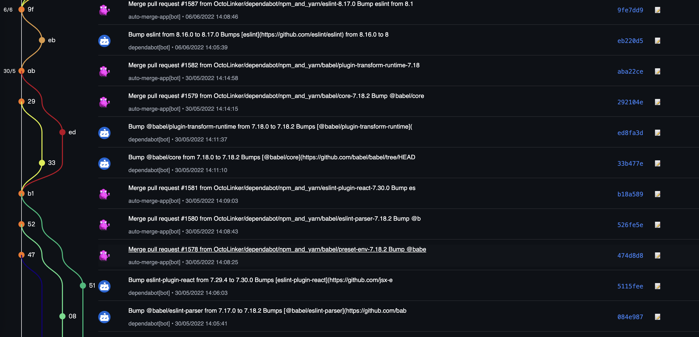

# 🧬 Git Graph Extension

Visualize your Git repository's commit history and branches directly in the browser using `gitgraph.js` and the GitHub API.



## 🚀 Features

- Interactive, visual Git commit history
- Supports branches and tags
- Fetches commits directly from GitHub
- Beautiful and customizable Git graphs
- Ideal for project overviews, presentations, or educational tools

---

## 🔐 GitHub Token Setup

To fetch commits from private or public repositories, you'll need a **GitHub Personal Access Token (PAT)**.

### 1. **Generate a GitHub Token**

Go to: [https://github.com/settings/tokens](https://github.com/settings/tokens)

- Click **"Generate new token (classic)"**
- Set a name like: `git-graph-extension`
- **Scopes required**:
  - `repo` (for private repositories)
  - `public_repo` (for public repositories)

Copy your token when prompted — **you won't see it again!**

---

### 2. **Create a `.env` File**

In the root of your project, create a `.env` file:

```bash
touch .env
```

Add the following line:

VITE_GITHUB_TOKEN=ghp_your_generated_token_here

### 3. **Install Dependencies**

```bash
npm install
```

### 4. **Install Dependencies**

```bash
npm run watch
```

This will:

Rebuild on file changes

Output to your dist/ directory

Allow you to load the unpacked extension in your browser (e.g. Chrome or Firefox)


